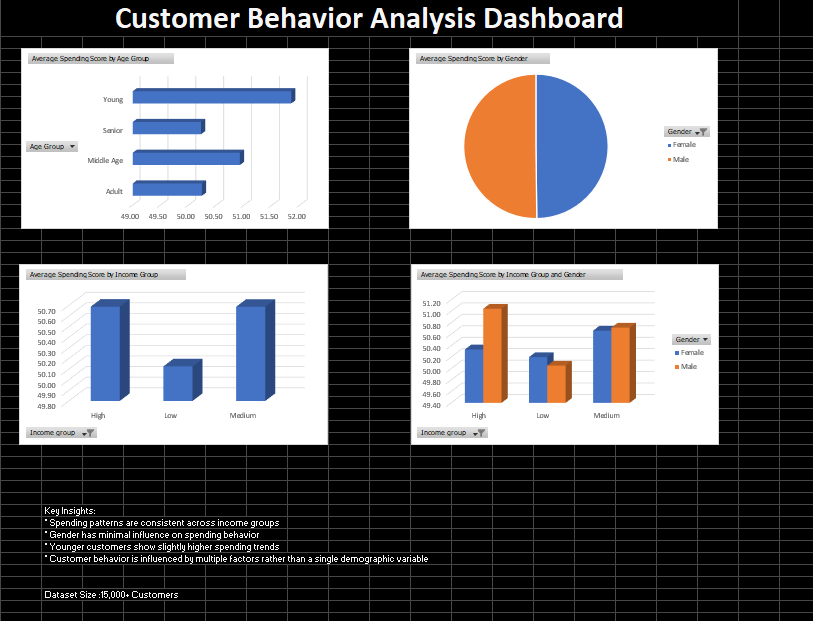

#  Customer Segmentation Analysis

##  Project Overview

This project focuses on **analyzing customer behavior** and segmenting customers into distinct groups using data-driven techniques. The goal is to help businesses understand their customers better and design targeted marketing strategies.

---

##  Methodology

1. Data Cleaning and Preprocessing
2. Exploratory Data Analysis (EDA)
3. Customer Segmentation using clustering techniques (e.g., K-Means)
4. Data Visualization using Power BI

---

## Key Insights

* Identified multiple customer segments based on income and spending patterns
* High-income, low-spending customers represent untapped potential
* Low-income, high-spending customers are key contributors to revenue
* Segmentation enables targeted marketing strategies

---

## Business Impact

* Helps businesses personalize marketing campaigns
* Improves customer retention strategies
* Enables better resource allocation

---

##  Conclusion

Customer segmentation is a powerful technique that allows businesses to better understand their audience and implement **data-driven strategies** for growth and customer satisfaction.

---

## Dashboard Preview

